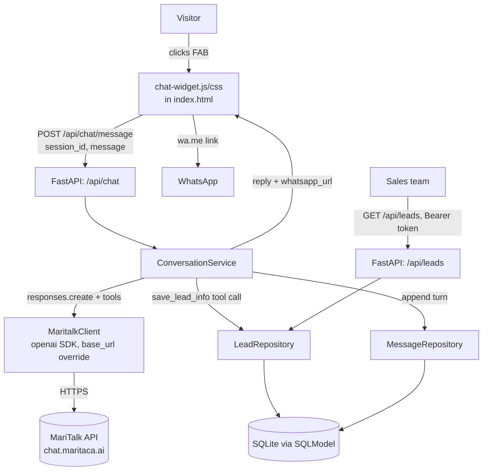

# Initial Support Chatbot Design

**Spec**: `.specs/features/initial-support-chatbot/spec.md`
**Context**: `.specs/features/initial-support-chatbot/context.md`
**Status**: Approved

---

## Research Notes (Knowledge Verification Chain)

Codebase/docs had no prior backend or MariTalk usage, so the API contract was verified against the current (2026-09-14) official sources before designing against it:

- `github.com/maritaca-ai/maritalk-api` README (fetched raw) — confirms the API is OpenAI-compatible via the **Responses API** surface (`client.responses.create`, not the classic `chat.completions.create`), reached by pointing the official `openai` Python SDK's `base_url` at `https://chat.maritaca.ai/api`. Recommended models today: `sabia-4` and `sabiazinho-4` (the project's `.env` already has `MARITALK_MODEL="sabiazinho-4"`).
- `docs.maritaca.ai/pt/chamada-funcao` — confirms **native function calling** on the Responses API: a `tools` list (`type: "function"`, `name`, `description`, JSON-schema `parameters`), model returns `response.output` items with `type == "function_call"` (`call_id`, `name`, `arguments` as a JSON string); the caller executes the function and replies with a `function_call_output` item to continue the turn. This backs the "conversational, structured extraction" decision from `context.md` — the lead fields are extracted via a real tool call (`save_lead_info`), not fragile prompt-parsed JSON.
- Response text for a plain turn is read from `response.output[0].content[0].text`; streaming (not used here per the confirmed REST-sync approach) emits `response.output_text.delta` events.

**Approach exploration (chat transport) — presented to and confirmed by the user:**

| Approach | Trade-off | Verdict |
| --- | --- | --- |
| **Synchronous REST** (`POST /api/chat/message`, full reply in the response) | Simplest to build/test/rate-limit/host; no real-time token streaming (short "digitando..." wait instead) | **Chosen** |
| WebSocket | Real token-by-token streaming; adds connection lifecycle, reconnection, and harder per-message rate limiting | Rejected — complexity not justified for a short triage chatbot |
| SSE hybrid (POST + GET stream) | Streaming over plain HTTP; doubles endpoint surface, needs POST↔stream correlation | Rejected — same reasoning, extra surface for a benefit the MVP doesn't need |

---

## Architecture Overview

Two independently deployable pieces: the existing static site (unchanged hosting) gets a small vanilla-JS/CSS widget, and a new FastAPI service owns the MariTalk integration, conversation/lead persistence, and the admin leads API. The widget only ever talks REST to the backend; the backend is the only thing that talks to MariTalk.



---

## Code Reuse Analysis

### Existing Components to Leverage

| Component | Location | How to Use |
| --- | --- | --- |
| Design system (colors, fonts, `data-theme`) | `css/style.css` | New `css/chat-widget.css` reuses the same CSS custom properties/theme tokens instead of introducing a new palette |
| i18n system | `js/i18n.js`, `data/content-pt.json`, `data/content-en.json` | Add a `chatWidget.*` key block to both content files for the widget's static UI chrome (button labels, consent text, placeholder); `chat-widget.js` reads via the existing `data-i18n` attribute convention |
| WhatsApp CTA pattern | `index.html` `#contato` (`https://wa.me/5500000000000`) | Reuse the same phone-number placeholder and `wa.me` link shape for the widget's handoff button (`WHATSAPP_NUMBER` env var on the backend, kept identical to this placeholder until the real number is supplied) |
| Solution categories | `data/content-pt.json` `solutions.card1..4` | Source of truth for the 4 lead categories + "Outro" used in the `save_lead_info` tool schema and the `Lead.category` enum |
| Theme toggle script pattern | `js/theme.js` | Same vanilla-JS, no-framework, DOMContentLoaded-listener style is followed by `chat-widget.js` |

### Integration Points

| System | Integration Method |
| --- | --- |
| MariTalk (Maritaca AI) | `openai.AsyncOpenAI(api_key=MARITALK_API_KEY, base_url=MARITALK_API_BASE)`, `client.responses.create(model=MARITALK_MODEL, input=..., tools=[save_lead_info_schema])` |
| Static site → backend | Plain `fetch()` REST calls from `chat-widget.js` to a configurable `API_BASE_URL` (new `js/config.js`, defaults to `http://localhost:8000` for local dev) |
| `.env` secrets | Backend reads `MARITALK_API_KEY`, `MARITALK_API_BASE`, `MARITALK_MODEL`, plus new `ADMIN_API_TOKEN`, `WHATSAPP_NUMBER`, `ALLOWED_ORIGINS` via `pydantic-settings`; `.env` already `.gitignore`d (added in the repo-init commit) |

---

## Components

### `chat-widget` (frontend)

- **Purpose**: Floating chat icon + panel that drives the whole P1 conversation UX.
- **Location**: `js/chat-widget.js`, `css/chat-widget.css`, plus static markup added to `index.html` (FAB button + hidden panel, alongside the existing header/nav markup) and new `chatWidget.*` i18n keys in `data/content-{pt,en}.json`.
- **Interfaces**:
  - `initChatWidget(): void` — wires the FAB click, renders the greeting + LGPD notice, restores history if a `session_id` exists in `sessionStorage` (P3).
  - `sendMessage(text: string): Promise<void>` — client-side validation (non-empty, <1000 chars), POSTs to the backend, disables input while in flight (AC CHAT-11), renders the reply or the fallback/rate-limit state.
- **Dependencies**: `js/config.js` (API base URL), backend `/api/chat/*` endpoints.
- **Reuses**: design tokens from `css/style.css`, i18n pattern from `js/i18n.js`.

### `ConversationService` (backend domain)

- **Purpose**: Owns one chat turn end-to-end — builds the message history, calls the LLM, executes any `save_lead_info` tool call, decides when to surface the WhatsApp handoff, persists messages/leads.
- **Location**: `backend/app/domain/conversation.py`
- **Interfaces**:
  - `async def handle_turn(session_id: str, user_message: str) -> TurnResult` — `TurnResult{reply: str, lead_captured: bool, whatsapp_url: str | None}`
- **Dependencies**: `LLMClient` protocol, `LeadRepository`, `MessageRepository`, the system prompt template.
- **Reuses**: nothing pre-existing (new domain), but the category list is sourced from `data/content-pt.json` at build/config time (copied into the system prompt, not re-derived at runtime, to avoid a cross-service file read).

### `LLMClient` protocol + `MaritalkClient` (backend llm)

- **Purpose**: Isolates the MariTalk-specific wire format so a future provider swap only means writing a new class against the same protocol (per `context.md`'s "verifico possibilidade de mudança").
- **Location**: `backend/app/llm/client.py` (protocol + `FakeLLMClient` test double), `backend/app/llm/maritalk_client.py` (real implementation), `backend/app/llm/tools.py` (the `save_lead_info` tool JSON schema + system prompt template).
- **Interfaces**:
  - `async def complete(messages: list[Message], tools: list[dict]) -> LLMResult` — `LLMResult{text: str, tool_call: ToolCall | None}`
- **Dependencies**: `openai` SDK (works against MariTalk because of its OpenAI-compatible Responses API), `MARITALK_*` settings.
- **Reuses**: n/a (new integration).

### `LeadRepository` / `MessageRepository` (backend storage)

- **Purpose**: Persistence for leads and per-session transcripts, upserting one `Lead` row per `session_id`.
- **Location**: `backend/app/storage/models.py` (SQLModel table models), `backend/app/storage/repository.py`, `backend/app/storage/db.py` (engine/session setup, SQLite file at `backend/data/app.db`).
- **Interfaces**:
  - `async def upsert_lead(session_id, category, need_summary, contact) -> Lead`
  - `async def list_leads() -> list[Lead]`
  - `async def append_message(session_id, role, content) -> None`
  - `async def get_history(session_id) -> list[Message]`
- **Dependencies**: SQLModel/SQLAlchemy, SQLite file.
- **Reuses**: n/a.

### `RateLimiter` (backend api)

- **Purpose**: Enforces the spec's per-session limits (15 msg/min, 60 msg/session) before a request reaches the LLM.
- **Location**: `backend/app/api/rate_limit.py`
- **Interfaces**:
  - `def check(session_id: str) -> bool` — in-memory sliding window/counter, single-process scope (see Risks & Concerns).
- **Dependencies**: none external.
- **Reuses**: n/a.

### API routers (backend api)

- **Purpose**: HTTP surface.
- **Location**: `backend/app/api/chat.py`, `backend/app/api/leads.py`, wired in `backend/app/main.py` (CORS via `ALLOWED_ORIGINS`).
- **Interfaces**:
  - `POST /api/chat/message` — body `{session_id: str, message: str}` → `200 {reply, lead_captured, whatsapp_url}` / `422` (validation) / `429` (rate limit) / `503` (MariTalk unreachable, fallback reply still returned with `200` per AC CHAT-09 — see Error Handling).
  - `GET /api/chat/{session_id}/history` — P3, → `200 {messages: [...]}`.
  - `GET /api/leads` — P2, `Authorization: Bearer <ADMIN_API_TOKEN>` required → `200 {leads: [...]}` / `401`.
- **Dependencies**: `ConversationService`, `RateLimiter`, `LeadRepository`.
- **Reuses**: n/a.

---

## Data Models

### `Lead` (SQLModel table)

```python
class Lead(SQLModel, table=True):
    id: int | None = Field(default=None, primary_key=True)
    session_id: str = Field(unique=True, index=True)
    category: str  # "gestao_empresas" | "whatsapp_atendimento" | "analise_documentos" | "gerador_conteudo" | "outro"
    need_summary: str
    contact_name: str | None = None
    contact_phone: str | None = None
    contact_email: str | None = None
    has_contact: bool = False
    created_at: datetime
    updated_at: datetime
```

### `Message` (SQLModel table)

```python
class Message(SQLModel, table=True):
    id: int | None = Field(default=None, primary_key=True)
    session_id: str = Field(index=True)
    role: str  # "user" | "assistant"
    content: str
    created_at: datetime
```

**Relationships**: `Message.session_id` and `Lead.session_id` share the same client-generated UUID (no FK enforced across engines to keep the schema simple); one `Lead` row per `session_id`, many `Message` rows per `session_id`, ordered by `created_at` for history and for LLM context reconstruction.

---

## Error Handling Strategy

| Error Scenario | Handling | User Impact |
| --- | --- | --- |
| Empty / >1000-char message | Rejected client-side (widget) and re-validated server-side (Pydantic) with `422` | Inline validation message, no request wasted on the LLM |
| MariTalk timeout/5xx/network error | `MaritalkClient` catches and raises a typed `LLMUnavailableError`; `ConversationService` still returns `200` with a canned Portuguese fallback reply (apology + WhatsApp button) and logs the failure | Conversation never gets stuck; visitor always has the WhatsApp fallback |
| MariTalk returns malformed/unexpected tool-call arguments | JSON-decode/validation failure on `arguments` is caught; the turn is treated as a plain conversational reply and extraction is retried next turn | No crash; visitor sees a normal reply, lead just isn't finalized yet |
| Rate limit exceeded (15/min or 60/session) | `RateLimiter.check` fails fast before calling the LLM; router returns `429` | Widget shows a friendly "aguarde um instante" message, no auto-retry |
| Lead persistence (DB write) fails after a successful LLM reply | Reply is still returned to the visitor; the DB error is logged | Visitor unaffected; team must be told this can silently drop a lead (see Risks & Concerns) |
| `GET /api/leads` without/with wrong token | FastAPI dependency raises `401` before touching the repository | No data returned, no side channel leak |
| Two browser tabs, same visitor | Each tab has its own `sessionStorage` UUID → independent `session_id`, independent `Lead` row (per spec Edge Cases) | Two leads created; acceptable per spec, no dedup required in MVP |

---

## Risks & Concerns

| Concern | Location (file:line) | Impact | Mitigation |
| --- | --- | --- | --- |
| In-memory rate limiter only works within a single backend process | `backend/app/api/rate_limit.py` (new) | Limits are per-process; horizontally scaling the backend to N replicas effectively multiplies the limit by N | Acceptable for MVP (single-process deploy); documented here so a future move to multiple replicas comes with a task to swap in a shared store (e.g., Redis) instead of silently under-protecting the paid MariTalk API |
| `.env` held live API keys and was untracked/un-ignored before this feature | `.env:1-4` | Secret leakage if ever committed | Already mitigated: `.gitignore` added and the repo's baseline commit excludes `.env` (see repo-init commit `0121da5`) |
| DB write failure after a successful LLM reply is swallowed (logged, not surfaced) | `ConversationService.handle_turn` (new) | A lead could silently fail to save while the visitor sees a normal reply | Logged with `session_id` + error for after-the-fact recovery; acceptable for MVP given SQLite-write failures are rare/environmental, not a routine path; revisit if it shows up in logs |
| `WHATSAPP_NUMBER` is still the placeholder `5500000000000` used elsewhere in `index.html` | `index.html` (existing `#contato` CTA) | Handoff button would link to a non-working number if shipped as-is | Not this feature's job to source the real number; both the existing CTA and the new backend setting must be updated together before going live — flagged to the user, not silently "fixed" with a fabricated number |
| No existing backend/test tooling in the repo (first Python code in this project) | project root | Nothing to reuse; every convention (settings, DB session handling, test fixtures) is established fresh here | Kept deliberately minimal/standard (FastAPI + SQLModel + pytest + httpx) so it doesn't lock future features into anything unusual; recorded as `AD-001` in `.specs/STATE.md` |

> None beyond the above found in the areas this feature touches.

---

## Tech Decisions (only non-obvious ones)

| Decision | Choice | Rationale |
| --- | --- | --- |
| LLM integration surface | Official `openai` Python SDK pointed at MariTalk's OpenAI-compatible **Responses API** (`client.responses.create`, not `chat.completions.create`) | Verified against current MariTalk docs/README (2026-09-14); using the officially documented surface avoids depending on the older raw `/chat/inference` endpoint seen in some examples |
| Structured lead extraction | Native MariTalk **function calling** (`tools=[save_lead_info]`) rather than prompt-asking for a JSON blob | Confirmed supported on `sabia-4`/`sabiazinho-4`; far more reliable than parsing free-text JSON out of a chat reply, and matches the "conversational, structured extraction" decision in `context.md` |
| Provider abstraction | `LLMClient` Protocol with `MaritalkClient` (real) and `FakeLLMClient` (tests) | Lets the user swap providers later by writing one new class; also makes backend tests hermetic — they never call the real, paid MariTalk API |
| Persistence | SQLite via SQLModel, single file under `backend/data/` | Zero extra infrastructure for an MVP-scale lead volume; SQLModel gives typed models + easy migration to Postgres later (same ORM, different connection string) if volume grows |
| Chat transport | Synchronous REST (confirmed with the user over WebSocket/SSE alternatives) | Simplicity, testability, and hosting-friendliness outweigh the lack of token-streaming for a short triage bot |
| Frontend/backend boundary | Backend never serves the static site; widget calls a configurable `API_BASE_URL` | Keeps the two independently deployable, matching the "clear front/back architecture" requirement |
| Widget UI chrome language | Routed through the existing i18n system (PT/EN) like the rest of the site; only the bot's own conversational replies are hard-locked to Portuguese | Extends an existing, working convention instead of introducing a second one; consistent with the user's decision, which was specifically about bot replies |

> **Project-level decision recorded as `AD-001` in `.specs/STATE.md`**: the backend stack (FastAPI + SQLModel/SQLite + pytest + the `LLMClient` protocol pattern) becomes the default for future backend features in this project unless explicitly superseded.
